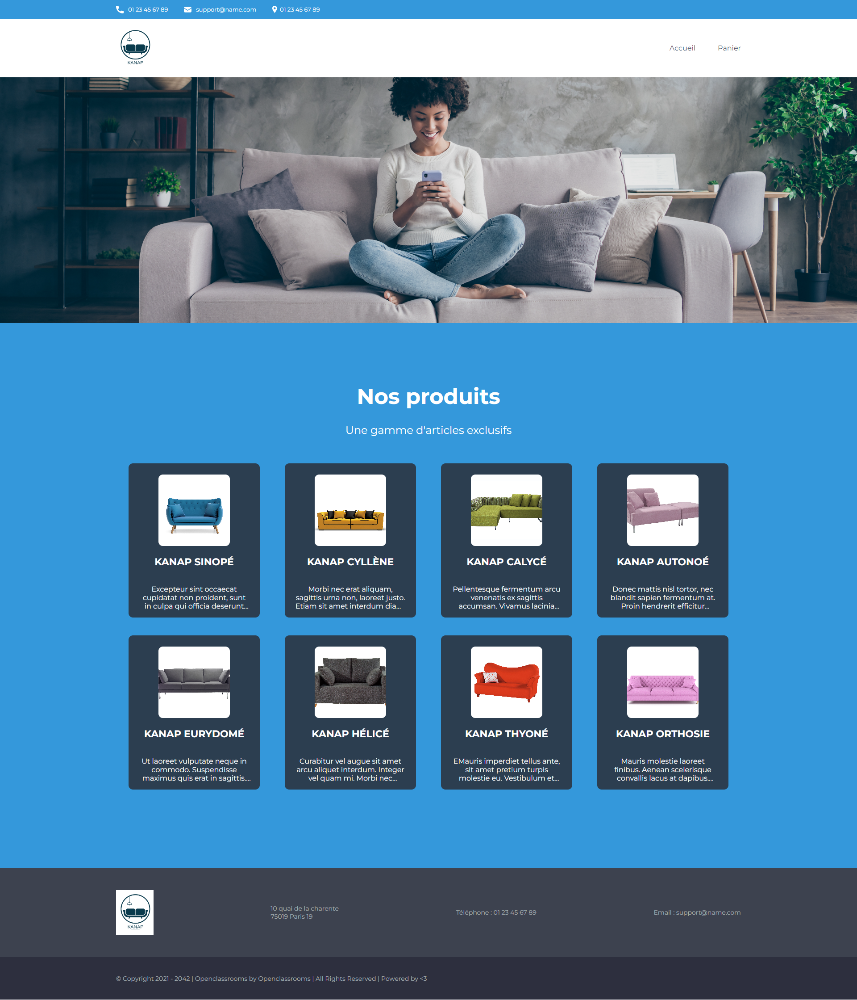

# Kanap
### OpenClassrooms P5 - Construisez un site e-commerce en JavaScript

**Kanap** est une marque de canapés qui vend ses produits depuis sa boutique exclusivement. *Aujourd’hui, celle-ci souhaiterait avoir une plateforme de e-commerce en plus de sa boutique physique pour vendre ses produits sur Internet.* À partir d'une interface **front-end** en **HTML/CSS** existante, l'objectif est donc d'**intégrer dynamiquement** les éléments de l’**API** dans les différentes pages web avec **JavaScript**. Dans un second temps, le but est de mettre en place un plan de test d’acceptation pour valider le site web réalisé.

## Architecture générale

L’**application web** est composée de 4 pages :
* Une **page d’accueil** montrant (de manière dynamique) **tous les articles** disponibles à la vente
* Une **page "Produit"** qui affiche (de manière dynamique) les **détails** du **produit** sur lequel l'utilisateur a cliqué depuis la page d’accueil. Depuis cette page, l’utilisateur peut sélectionner une **quantité**, une **couleur**, et **ajouter le produit à son panier**
* Une page "Panier". Celle-ci contient plusieurs parties :
  * Un résumé des **produits dans le panier**, le **prix total** et la possibilité de **modifier la quantité** d’un produit sélectionné ou bien de **supprimer** celui-ci
  * Un **formulaire** permettant de **passer commande**. Les données du formulaire doivent être correctes et bien formatées avant d'être renvoyées au back-end. Par exemple, pas de chiffre dans un champ prénom
* Une page “confirmation” :
  * Un message de **confirmation de commande**, remerciant l'utilisateur pour sa commande, et indiquant l'**identifiant de commande** renvoyé par l’API

